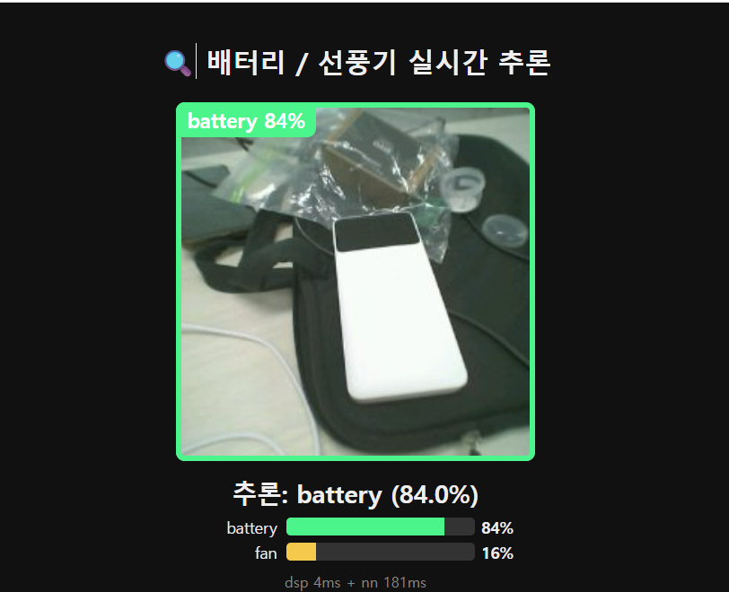
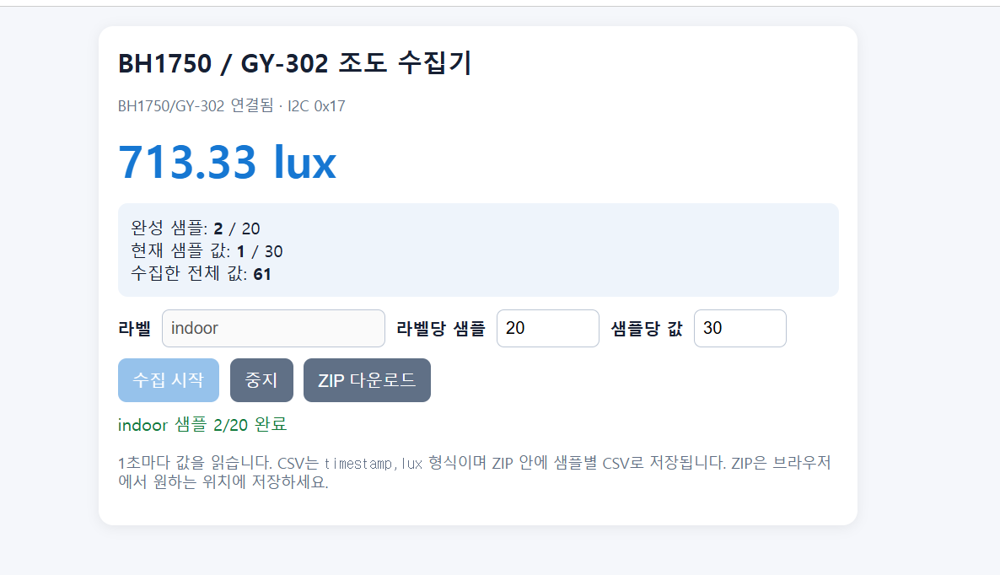

# XIAO ESP32-S3 Sense로 배우는 TinyML

> 카메라와 센서가 만든 원시 데이터를 수집하고, Edge Impulse로 학습한 뒤, 다시 보드에서 실시간으로 판단해 보는 오늘의 실습 정리

| 항목 | 내용 |
|---|---|
| 보드 | Seeed XIAO ESP32-S3 Sense |
| 카메라 분류 | `battery` / `fan` |
| 센서 | BH1750 · BME280 · BNO055 |
| 네트워크 | Standalone AP, `bkh`, `192.168.4.1` |
| 자료 폴더 | `C:\arduinoTest\camera_dataset` · `C:\arduinoTest\sensorTest` |

## 1. 오늘 배운 전체 흐름


핵심은 장치를 연결하는 것에서 끝나지 않는다. **입력 → 데이터셋 → 모델 → 현장 추론**이 하나의 흐름으로 이어져야 한다.

### 오늘 실제로 만든 것

- 카메라: `battery` / `fan` 이미지 분류 데이터셋과 Arduino 배포 모델
- 센서: BH1750 조도 값을 1초 간격 CSV 시계열로 저장
- 서비스: 보드의 AP와 휴대폰 브라우저를 이용한 수집·모니터링 화면
- 검증: 학습 정확도뿐 아니라 held-out test와 실제 배포 포맷까지 비교

## 2. ESP32-S3의 특징

XIAO ESP32-S3 Sense는 센서와 카메라를 읽고, Wi-Fi 서비스를 제공하며, TinyML 추론까지 수행할 수 있는 작은 현장 컴퓨터다.

| 기능 | 오늘 실습에서의 역할 |
|---|---|
| Wi-Fi AP | 보드가 직접 `bkh` 핫스팟이 되어 휴대폰과 연결 |
| Wi-Fi STA | 필요하면 기존 공유기에 연결하는 확장 방식 |
| 카메라 + PSRAM | 이미지 수집과 카메라 모델 실행 |
| GPIO / I²C | BH1750, BME280, BNO055 연결 |
| USB Serial | 부팅 상태와 센서 값을 `115200 baud`로 확인 |
| TinyML on-device | 인터넷 없이 보드 안에서 분류 실행 |

카메라와 모델을 사용할 때는 PSRAM 옵션이 필요하다.

```powershell
arduino-cli compile --fqbn esp32:esp32:XIAO_ESP32S3 `
  --board-options PSRAM=opi <SKETCH_DIR>
```

## 3. 서비스의 특징: 보드가 웹 서버가 된다

### 연결 순서

1. 휴대폰 Wi-Fi에서 `bkh`를 선택한다.
2. 브라우저에서 `http://192.168.4.1`을 연다.
3. 별도 앱 설치 없이 수집기 또는 실시간 추론 화면을 사용한다.

### 제공하는 기능

- 카메라 사진을 라벨별로 수집
- 브라우저에서 실시간 카메라 화면 확인
- 분류 결과와 클래스별 confidence 확인
- 사진 또는 센서 시계열 데이터를 ZIP으로 다운로드

### 수집기와 추론기는 다르다

| 화면 | 목적 | 결과 |
|---|---|---|
| Dataset collector | 학습용 데이터를 모으기 | 사진 갤러리 또는 CSV ZIP |
| Inference viewer | 새 입력을 모델에 넣기 | 라벨·confidence·처리 시간 |

카메라 수집기는 `1장 캡처`와 `20장 버스트`를 지원한다. 갤러리는 브라우저 안에 임시로 보관되므로 **새로 고침 전에 반드시 ZIP을 다운로드**해야 한다. 서비스용 AP 비밀번호는 실습용 예시일 뿐, 실제 서비스에서는 별도의 비밀번호를 사용한다.

> AP 모드에서는 휴대폰이 보드에 직접 연결되므로 연결 중에는 휴대폰 인터넷이 끊기는 것이 정상이다. 이 서비스는 수업·실습·현장 데모처럼 로컬 연결이 필요한 상황에 적합하다.

## 4. Edge Impulse의 이해

Edge Impulse는 단순한 학습 버튼이 아니라, 데이터를 모델로 바꾸고 다시 디바이스에 배포하는 작업 공간이다.

```text
Data acquisition
      ↓
Impulse design
      ↓
Generate features
      ↓
Train
      ↓
Model testing
      ↓
Arduino deployment
```

### 이번 카메라 모델 설정

| 설정 | 값 |
|---|---|
| 문제 유형 | Image classification |
| 입력 크기 | `96 × 96` |
| Resize | `squash` |
| Learning block | Keras transfer learning |
| Training cycles | `20` |
| Learning rate | `0.0005` |
| 배포 파일 | `battery-fan-classifier-arduino.zip` |
| Arduino library | `EI_project_inferencing` |

이미지 분류와 센서 시계열은 같은 Edge Impulse를 사용하더라도 입력 데이터의 모양과 impulse 설계가 다르다.

이번 프로젝트에서 모델은 하나의 프로젝트 안에서 이미지 분류 문제로 설계했다. 센서 시계열을 별도의 모델로 학습하려면 시계열 입력 블록과 샘플 주기·윈도우 길이를 다시 설계해야 한다.

## 5. 카메라 데이터셋 만들기

카메라 수집기에서 `battery`와 `fan` 라벨을 나누어 사진을 모았다.

| 항목 | 수량 |
|---|---:|
| 전체 이미지 | **304장** |
| `battery` | 154장 |
| `fan` | 150장 |
| Training split | 241장, 약 79% |
| Testing split | 63장, 약 21% |

### 사진을 모으는 실제 순서

1. `http://192.168.4.1`에서 라벨을 입력한다.
2. `1장 캡처` 또는 `20장 버스트`로 사진을 모은다.
3. 라벨당 약 150장 정도를 모은 뒤 필요 없는 사진을 정리한다.
4. `전체 ZIP 다운로드`로 저장하고 나서 페이지를 새로 고친다.

모델의 문제 유형은 **image classification**이다. 따라서 화면 전체에 하나의 라벨을 붙이는 방식이며, 사진 속 여러 물체의 위치를 사각형으로 찾는 object detection이나 FOMO 모델과는 다르다.

데이터를 모을 때는 같은 물체라도 다음 조건을 바꾸어야 한다.

- 촬영 각도와 거리
- 배경과 조명
- 물체의 방향과 위치
- 실제 사용할 환경



## 6. 학습 결과와 배포 전 확인

학습 리포트에서는 최종 validation accuracy가 `100%`에 도달했다. 하지만 실제 배포 포맷별 테스트 결과는 달랐다.

| 모델 형식 | Good | Bad | Accuracy |
|---|---:|---:|---:|
| float32 | 63 | 0 | **100%** |
| int8 | 50 | 13 | **79.4%** |

특히 int8 테스트에서 `fan`은 36/36으로 잘 분류했지만, `battery`는 27개 중 14개만 battery로 맞췄고 6개는 uncertain으로 남았다.

따라서 모델을 믿기 전에 다음을 다시 확인해야 한다.

1. 실제 보드에서 사용하는 포맷이 무엇인가?
2. 학습에 없던 새 이미지에서도 잘 동작하는가?
3. 조명·각도·배경이 바뀌어도 라벨의 의미가 유지되는가?

> 높은 validation accuracy와 현장 성능은 같은 말이 아니다.

### 배포 때 추가로 확인할 것

- 학습이 끝난 뒤 생성된 `EI_project_inferencing` 라이브러리를 Arduino sketchbook의 `libraries` 폴더에 설치한다.
- 같은 이름의 Edge Impulse 라이브러리를 교체했다면 첫 컴파일에 `--clean`을 사용한다.
- ESP32-S3에서 tensor arena overflow가 발생하면 모델의 메모리 요구량과 PSRAM 배치를 확인한다.
- XIAO Sense 카메라는 화면이 90° 회전되어 들어올 수 있으므로, 전처리에서 CW 회전 보정을 적용하고 보정 없음/CW/CCW 결과를 비교한다.

## 7. 휴대폰으로 연결하는 실시간 라이브

여기서 휴대폰은 카메라 자체가 아니라 **화면과 조작기**다. 실제 촬영과 추론은 XIAO ESP32-S3 Sense에서 수행하고, 휴대폰 브라우저가 그 결과를 보여 준다.

```text
휴대폰 Wi-Fi: bkh
        ↓
브라우저: http://192.168.4.1
        ↓
XIAO Sense 카메라 프레임
        ↓
battery 84% / fan 16% 같은 실시간 결과
```


실습 영상: [ai 컴퓨팅프로젝트 실습.mp4](./ai%20컴퓨팅프로젝트%20실습.mp4)

## 8. I²C 센서 버스

XIAO ESP32-S3에서 오늘 사용한 I²C 핀은 고정되어 있다.

| 신호 | XIAO ESP32-S3 |
|---|---|
| SDA | D4 / GPIO5 |
| SCL | D5 / GPIO6 |
| 전원 | 3V3 |
| 접지 | GND |

코드에서는 핀을 명시한다.

```cpp
Wire.begin(D4, D5);
```

인자가 없는 `Wire.begin()`은 이 보드에서 올바른 핀을 선택하지 않을 수 있다.

### 센서 주소와 역할

| 센서 | 역할 | 주소 |
|---|---|---:|
| BH1750 / GY-302 | 조도, lux | `0x23` 또는 `0x5C` 가능 |
| BME280 | 온도·기압·습도 | `0x76` 또는 `0x77` 가능 |
| BNO055 | heading·roll·pitch·보정 상태 | `0x28` 또는 `0x29` 가능 |

여러 센서를 같은 버스에 연결할 때는 주소가 겹치지 않아야 한다.

이번 자료의 기본 설정은 **BH1750 `0x23` · BME280 `0x76` · BNO055 `0x29`**이다. 주소는 모듈의 ADDR/SDO 설정에 따라 달라질 수 있으므로, 아래 순서로 확정한다.

```text
I²C scan → 응답 주소 확인 → CHIP_ID 확인 → 해당 드라이버 선택
```

검증 예시에서는 `0x76`의 `CHIP_ID=0x60`으로 BME280을 확인했고, `0x29`의 BNO055 `CHIP_ID=0xA0`도 확인했다.

> `sensorTest.ino`의 현재 허브 스케치는 I²C 버스를 스캔하면서 BH1750 조도를 읽는 구성이다. BME280과 BNO055는 각각 `examples/BME280_0x76`과 `examples/BNO055_0x29`의 전용 예제로 확인한다.

## 9. BH1750 조도 데이터 수집

`BH1750_AP_logger`는 조도 값을 1초마다 읽고 브라우저에서 시계열 샘플을 만든다.



### 현재 저장된 데이터

| 항목 | 값 |
|---|---:|
| 파일 | 20개 CSV |
| 라벨 | `indoor` |
| 파일당 값 | 30개 |
| 전체 값 | 600개 |
| 샘플 주기 | 1 Hz |
| CSV 열 | `timestamp,lux` |
| 전체 관측 범위 | 0–787.5 lux |
| 전체 평균 | 345.61 lux |

### 수집기 사용 순서

1. 휴대폰을 `bkh` AP에 연결한다.
2. 라벨과 라벨당 샘플 수를 입력한다.
3. `수집 시작`을 누르면 1초마다 값이 쌓인다.
4. 값 30개가 모이면 30초짜리 CSV 샘플 하나가 완성된다.
5. 라벨을 바꿀 때는 먼저 수집을 중지하고, 새 라벨로 다시 시작한다.
6. 완성된 샘플을 `ZIP 다운로드`로 저장한다.

CSV 하나는 30초 동안의 값이다.

```text
timestamp,lux
0,602.500
1000,614.167
2000,578.333
...
29000,683.333
```

현재는 `indoor` 라벨만 있으므로, 의미 있는 분류 모델을 만들려면 다른 조명 환경과 라벨을 추가해야 한다. 수집기 기본 권장값은 **라벨당 100개 샘플**, 샘플당 **30개 값**이다.

참고로 전체 600개 값의 평균은 `345.61 lux`이지만, 첫 번째 샘플 `indoor.0001.csv`의 평균은 약 `658.6 lux`이다. 일부 CSV에는 어두운 구간이 포함되어 있어 파일별 환경 차이를 확인한 뒤 평균을 해석해야 한다.

## 10. 센서 데이터를 믿기 위한 디버깅 규칙

### 1) 항상 스캔부터 한다

모듈에 인쇄된 이름보다 실제 I²C 응답 주소를 먼저 확인한다.

### 2) 주소만으로 부품을 단정하지 않는다

`0x76`은 BME280일 수도 있고 BMP280일 수도 있다. 칩 ID를 읽어 확인한다.

| CHIP_ID 레지스터 `0xD0` | 부품 |
|---:|---|
| `0x60` | BME280 |
| `0x58` | BMP280 |
| `0x61` | BME680 |
| `0x55` | BMP180 |

### 3) 센서마다 시작 시간을 기다린다

BH1750은 시작 직후 바로 읽지 말고 약 120–200ms 기다린다. 첫 값이 `0`이라고 바로 배선 고장으로 판단하지 않는다.

### 4) 사람의 동작이 필요한 검사는 따로 둔다

빛을 가리거나, 습도 센서에 숨을 불거나, IMU를 회전시키는 검사는 자동 점수가 아니라 manual check로 기록한다.

### 5) BNO055의 0.00 문제

- 모듈 주소가 `0x29`라면 드라이버에도 `0x29`를 명시한다.
- 없는 32kHz 외부 크리스털을 선택하면 값이 0.00으로 고정될 수 있다.
- 주소와 센서 상태가 정상이어도 실제 fusion mode가 실행 중인지 확인한다.

### 6) USB Serial도 상태의 일부다

- `Serial.begin(115200);` 뒤에 약 3초 기다려 USB CDC가 준비되도록 한다.
- COM 포트를 열면 DTR 동작으로 보드가 리셋될 수 있다. 이것은 고장이 아니라 새 부팅 로그가 시작된 것이다.
- `arduino-cli monitor`는 계속 실행되어 자동 작업을 멈출 수 있으므로, 확인할 때는 제한 시간이 있는 serial read를 사용한다.

## 11. 재현 가능한 실습 순서

1. **배선**: 3V3, GND, D4/SDA, D5/SCL 연결
2. **스캔**: I²C 주소와 CHIP_ID 확인
3. **서비스 실행**: AP를 만들고 휴대폰에서 `192.168.4.1` 접속
4. **데이터 수집**: 라벨·환경별 사진 또는 CSV 저장
5. **학습**: train/test를 분리하고 모델 테스트 실행
6. **배포**: Arduino library를 설치하고 PSRAM 옵션으로 빌드
7. **현장 검증**: 새 입력, confidence, latency 확인

센서와 카메라는 같은 보드라도 확인 절차를 나누어 기록한다. 센서 쪽은 시리얼에서 주소와 값의 범위를 확인하고, 카메라 쪽은 휴대폰에서 AP·프레임·confidence를 확인한다.

기본 컴파일·업로드 형태:

```powershell
arduino-cli compile --fqbn esp32:esp32:XIAO_ESP32S3 <SKETCH_DIR>
arduino-cli upload -p <PORT> --fqbn esp32:esp32:XIAO_ESP32S3 <SKETCH_DIR>
```

카메라 또는 추론 스케치는 PSRAM 옵션을 추가한다.

```powershell
arduino-cli compile --fqbn esp32:esp32:XIAO_ESP32S3 `
  --board-options PSRAM=opi <SKETCH_DIR>
arduino-cli upload -p <PORT> --fqbn esp32:esp32:XIAO_ESP32S3 `
  --board-options PSRAM=opi <SKETCH_DIR>
```

## 12. 다음에 보완할 실험

- 카메라: 새 장소·조명·각도의 `battery`/`fan` 이미지를 추가하고 int8 모델을 다시 평가한다.
- 센서: `indoor` 외에 밝음·어두움·가림·창가 등 환경 라벨을 추가한다.
- 시계열: 라벨별 샘플 수를 맞추고, 같은 환경에서 반복되는 값과 실제 변화가 섞이지 않았는지 확인한다.
- 배포: float32와 int8의 정확도뿐 아니라 보드의 메모리 사용량과 추론 시간을 함께 기록한다.
- 라이브: AP 연결 시 휴대폰 인터넷이 끊기는 점을 안내하고, 여러 보드를 사용할 때는 AP 이름과 채널을 분리한다.

## 13. 오늘의 핵심 정리

- **ESP32-S3**는 센서·카메라·네트워크·추론을 한 장치에서 연결한다.
- **서비스**는 보드가 웹 서버가 되면서 앱 설치 없이 휴대폰에서 사용할 수 있다.
- **Edge Impulse**는 데이터 수집부터 배포까지 이어지는 파이프라인이다.
- **데이터셋**은 라벨 수뿐 아니라 환경·각도·조명·시간의 다양성이 중요하다.
- **모델 성능**은 validation accuracy만 보지 말고 실제 배포 포맷과 새 입력으로 확인해야 한다.
- **센서 디버깅**은 드라이버 작성보다 먼저 핀·주소·칩 ID·변환 시간을 확인하는 데서 시작한다.

> 좋은 모델은 좋은 데이터 파이프라인의 끝에서 나온다.

## 참고한 로컬 자료

- `C:\arduinoTest\camera_dataset\README.md`
- `C:\arduinoTest\camera_dataset\training_report.json`
- `C:\arduinoTest\camera_dataset\battery-fan-classifier-arduino.zip`
- `C:\arduinoTest\sensorTest\README.md`
- `C:\arduinoTest\sensorTest\sensorTest.ino`
- `C:\arduinoTest\sensorTest\examples\BH1750_AP_logger\BH1750_AP_logger.ino`
- `C:\arduinoTest\sensorTest\bh1750_dataset\bh1750_data\*.csv`
- `Webppt\index.html` 및 기존 실습 이미지·영상
